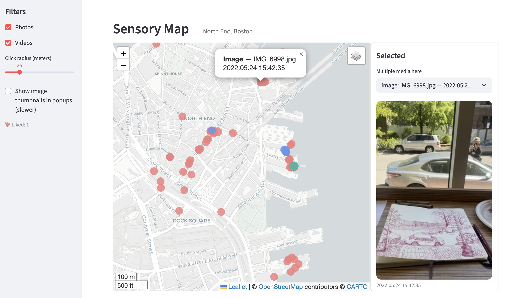

# Sensory Map

North End, Boston

This application serves as a digital journal of my explorations within the area.

Explore the app here: https://sensory.streamlit.app/

* Light coral markers: photos I've taken.
* Cornflower blue markers: videos captured.
* Click a marker to view the photo/video in the right-hand panel.
* Like an image.
* Markers are placed using exact longitude and latitude from media metadata.



## Run locally

```bash
python3 -m venv .venv
. .venv/bin/activate
pip install -r requirements.txt
streamlit run streamlit_app.py
```
